# HKCCCU_APP-2024.09rev
Revamp school project of mobile application a Blockbuster like online video rental shop mobile application.

## Deploy
The web and API is packed in a compressed file, unzip and run the compiled binary will start the server.
```bash
./unziped_files/ast20207
```

You can also specify your own MySQL server
```bash
./unziped_files/ast20207 --db localhost:3306
```

The apk is built from the web pages.
No prebuild release as the URL changes based on the deployment server.
You can easily generate PWA apk from the site you are hosting using [PWA Builder](https://www.pwabuilder.com/).

## Feature

```mermaid
flowchart LR
    subgraph 'Online Shopping'
    uc1((View items))
    uc2((Make purchase))
    uc3((Complete Checkout))
    uc4((Log In))

    end
    customer[Customer👤]
    id[identity_provider🆔]
    pa[paypal💲]
    id--->uc1

    customer----->uc1
    customer-->uc2
    uc2 -. include .-> uc1
    uc2 -. include .-> uc3
    pa---->uc3
    customer--->uc4
```


## Develop
The user interface in developed with HTML, CSS and JQuery in PWA (progressive web application) standard.
The RESTful API is developed with Rust, as I still holding strong bias to Node.js
The database is DuckDB if no SQL access provided to the released binary in runtime.
